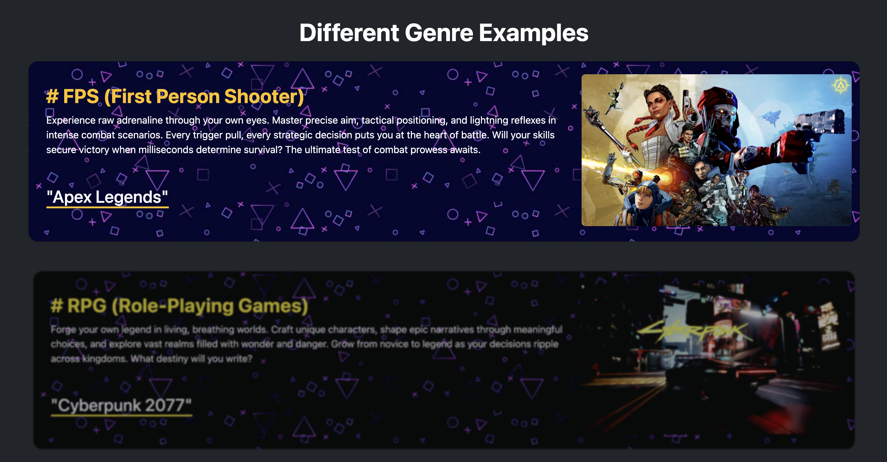
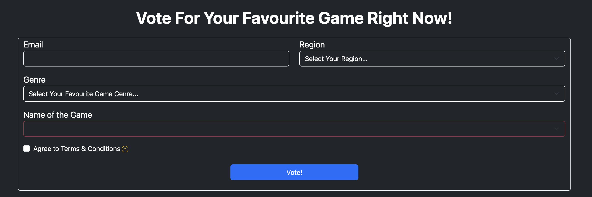

# Eric's Portfolio
Different projects I have done & keep tracking of my progress.
>[!Note]
> Keep Updating...

# [Web Development For Survey & Data Visualization(frontend & backend)](https://github.com/iuchifeieric-portfolio/TamJai-Samgor-Loyalty-Program-Evaluation/tree/main)
>[!Tip]
> Click the title to see more...

The Website is innovated by "Steam Awards" and designed for the players to vote for their favourite game accross different game genres. After players voted for their favourite game, the website will redirect them to the voting result. There are 3 charts that show the voting statistics (By region, genre, and terms agreement). Our slogan is "Every vote counts. Every genre matters. Every gamer has a voice.". By this voting, we can further leverage the data to support decisions making. For example, customize the game recommendation to every individual player.

## Introduction

## Game Genre

## Form

## Page After Voted

# [Tamjai Samgor Loyalty Program Evaluation](https://github.com/iuchifeieric-portfolio/TamJai-Samgor-Loyalty-Program-Evaluation/tree/main)
This is a group project to evaluate the current problems of TamJai's loyalty program and propose possible solutions to resolve those problems and also come up with innovative e-CRM stategies to further improve the loyalty program.

* Data was collected by web scrapping the ratings & comments from Google Play.
* Translate the comments from Chinese to English to ensure the data consistency and rephrase some sentences to enhance the accuracy of problem classification.
* Define different problem categories and leverage the LLM to do sentiment analysis and classification.
* Check the accuracy of the classification result and relabel the problem categories manually. 

## Tamjai's App Ratings

## Existing Problems of the Loyalty Program

# [Flight Infomation Database Creation & Management]()
# [HK Flag Day Volunteer Allocation System]()
# [Yahoo Finance Web Scrapping](https://github.com/iuchifeieric-portfolio/YahooFinance)
This is a project to extract and visualize the stock data by using yfinance API, and also extract the revenue data for Tesla and GME by web scraping.
- Define a Function that Makes a Graph.
- Use yfinance to Extract Stock Data.
- Use Webscraping to Extract Tesla Revenue Data.
- Plot Stock Graphs for Tesla & GME.
 

## Tesla Graph - Share Price & Revenue

## GME Graph - Share Price & Revenue

# [Dashboards with IBM Cognos]()
